  

  

#

  Sou desenvolvedor Full Stack, com 3+ anos de experiência prática em Flutter/Dart e projetos web, atuando também com React Native, Next.js e backend com Python/Django e Node.js. Tenho vivência em projetos completos, desde o desenvolvimento até o deploy, incluindo publicação nas lojas (Play Store e App Store), consumo de APIs REST e GraphQL, versionamento com Git, integração com Firebase e uso de bancos relacionais.

  
#

<h3 align="left">Connect with me!</h3>

<h3 align="left">Tecnologias & Ferramentas</h3>

<h4 align="left">📱 Mobile</h4>

  
  
  
  
  

<h4 align="left">🌐 Frontend</h4>

  
  
  
  
  
  
  
  
  
  
  
  
  
  
  

<h4 align="left">⚙️ Backend</h4>

  
  
  
  
  
  
  

<h4 align="left">🗄️ Banco de Dados</h4>

  
  
  
  
  
  
  

<h4 align="left">🔧 Ferramentas & DevOps</h4>

  
  
  
  
  
  
  

#

  <h3>* GitHub Stats *</h3>
   
  <table align="center" border="0" cellspacing="0" cellpadding="0">
    <tr>
      <td align="center">
        
      </td>
      <td align="center">
        
      </td>
    </tr>
  </table>

#

<picture align="center">
  <source media="(prefers-color-scheme: dark)" srcset="src/pacman-contribution-graph-dark.svg">
  <source media="(prefers-color-scheme: light)" srcset="src/pacman-contribution-graph.svg">
  
</picture>
